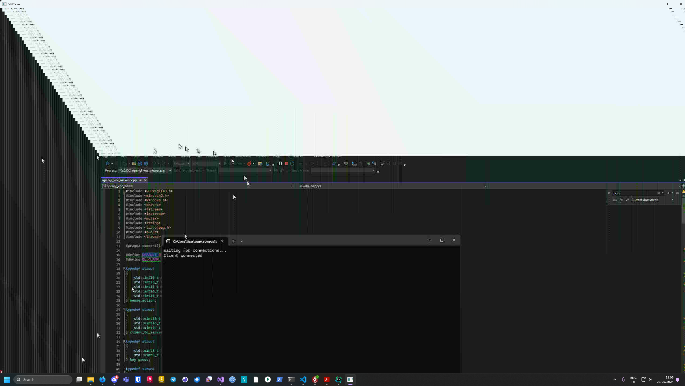

# VNC
This repo contains a simple vnc software

## How does it work?
- VNC server captures the screen
- captured screen is compressed using jpeg (compression adjustable)
- VNC server connects to a client and transmits the captured stream data
- VNC client receives the images, decompresses them and draws them onto the screen
- VNC client captures mouse and keyboard actions, sends them over the network
- VNC server interprets those actions, emulates keyboard and mouse

## How to build
Install msvc and msbuild, import the project and execute the final binaries. Please note, this tool is currently in beta thus keyboard and mouse emulation is still very buggy.

## How does it look like
Looks buggy because it captures the same screen the window is displayed on, if you use client and server on different devices, everything should work. 

